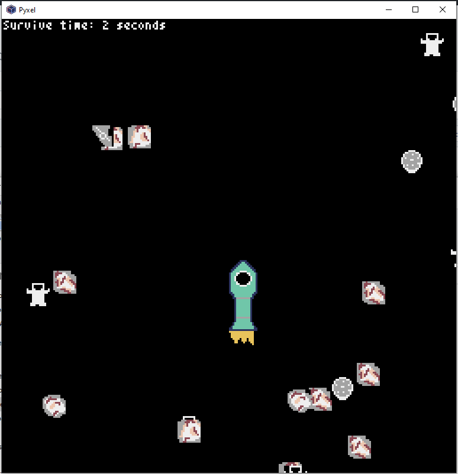
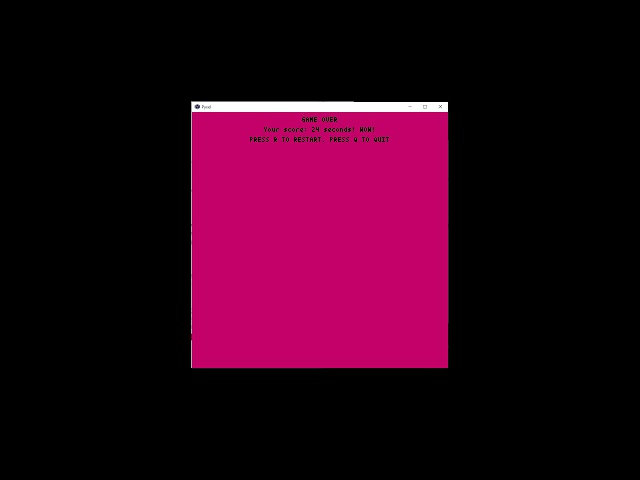

# MeteorAvoider

## Video Demonstration

## Project Overview
SpaceGarbageAvoider is a python pixel game in which you pilot a spaceship to avoid space garbage floating in space
## Inspiration
As the number of human spaceflight increases rapidly, the amount of space garbage accumulated in space also increases exponentially. SpaceGarbageAvoider is a game that raises awareness to this issue.
## What it does
SpaceGarbageAvoider is a game that involves you, the pilot of a spaceship, controlling your spaceship to avoid space garbage floating in space. You use the AWSD keys to move the spaceship up and down to avoid space garbage moving with a certain velocity. The longer you survive without hitting any space garbage the higher score you get in the end.
## How we built it
We built this game using the existing Python game engine called Pyxel. We created a meteor class to represent space garbage. We used the Pyxel Editor provided by Pyxel to design all the pixel models used in this game.
## Challenges we ran into
It is our first time building a game, so game development concepts like game loop, UserUpdate, render are new to us. We also learned that building a game is not only coding but also music and art. Lastly, completing a game in such a short time period is also a challenge for us.
## What's next for SpaceGarbageAvoider
We are planning to polish our game better in both art and code. Also, we are planning to make the spacecraft engine more realistic. Furthermore, we want to try to inverse the role of player and game designer, more specifically, we want players to try to place the space garbage, and the spacecraft can automatically avoid the garbage. We also would like to implement an AI that uses machine learning to learn this game and improve into a game player of this game.
